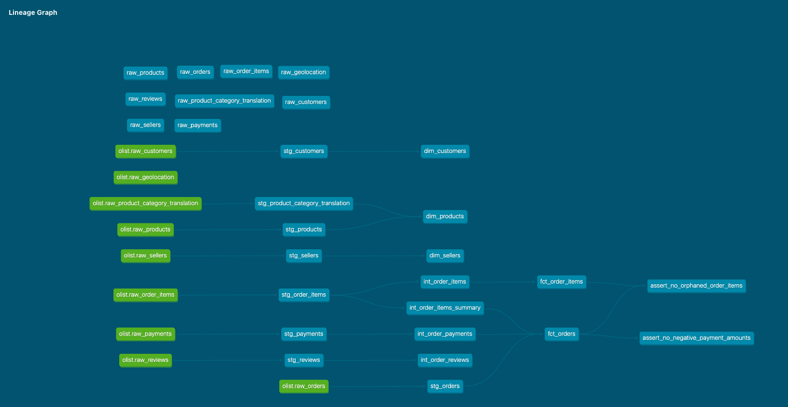

# AE Analytics Portfolio — Olist E-Commerce dbt Project


A dbt-core + DuckDB analytics engineering project transforming the [Olist Brazilian E-Commerce dataset](https://www.kaggle.com/datasets/olistbr/brazilian-ecommerce) into a tested, documented star schema.

This project takes 9 raw e-commerce tables through a staging → intermediate → marts pipeline, resolves a real grain-mismatch problem into a galaxy schema, and backs every model with schema and singular tests, full lineage documentation, and a GitHub Actions CI workflow that gates every pull request.

## Overview

Olist's raw data doesn't map cleanly onto a single fact table: an order can span multiple sellers and products through its line items, so `customer_id` is the only foreign key genuinely 1:1 with `order_id`. Rather than force a lossy compromise, the mart layer resolves this into a **galaxy schema** — two fact tables (`fct_orders` at order grain, `fct_order_items` at order-item grain) sharing three conformed dimensions (`dim_customers`, `dim_sellers`, `dim_products`).

A few design decisions worth calling out, each driven by profiling the actual data rather than assumption:

- **Payment logic required row-level investigation, not a naive `sum()`.** `payment_installments_count` is `sum(payment_installments)` scoped specifically to `payment_type = 'credit_card'` rows — summing across all rows inflates the count with structural noise from voucher rows, and `max()` breaks silently on the (real, confirmed) multi-credit-card order case.
- **Reviews aren't deduped to one row per order.** `raw_reviews` attaches the same `review_id` to multiple `order_id`s when a customer's orders are bundled into one review request — the true grain is `(order_id, review_id)`. `int_order_reviews` keeps that native grain and adds a deterministic surrogate key (`md5(order_id || '~' || review_id)`) instead of silently discarding bundled-review data through a dedup.
- **The intermediate layer exists only for grain-changing work.** Joins that don't change grain (e.g. `dim_products` joining the category-translation table) live inline in the mart SQL; only aggregation/dedup gets its own intermediate model. This kept the layer to exactly 4 models, each one tied to a specific grain mismatch between a staging source and its target mart.

## Architecture / Project DAG



Full project lineage, staging through marts — every edge is a `ref()`/`source()` call dbt discovered automatically, no manually maintained dependency graph.

## Setup

```bash
# clone and enter the project
git clone https://github.com/prateektuteja/ae-analytics-portfolio.git
cd ae-analytics-portfolio/ae_analytics_portfolio

# create and activate a virtual environment
python3 -m venv venv
source venv/bin/activate

# install dependencies
pip install -r requirements.txt

# configure your local profile (see profiles.yml example below)
dbt debug

# load seed data
dbt seed

# build the full project
dbt build
```

**Note:** `seeds/raw_geolocation.csv` is intentionally excluded from this repo (50MB+, over GitHub's file-size limit). No model depends on it — it's out of scope for the current star schema — but if you want it locally, download it separately from the [Kaggle dataset page](https://www.kaggle.com/datasets/olistbr/brazilian-ecommerce) and drop it into `seeds/`.

### profiles.yml (not committed — create at `~/.dbt/profiles.yml`)

```yaml
ae_analytics_portfolio:
  target: dev
  outputs:
    dev:
      type: duckdb
      path: dev.duckdb
      threads: 4
```

## Testing

```bash
dbt test
```

53+ tests across two layers, both re-evaluated automatically on every `dbt build`:

- **Schema tests** (`unique`, `not_null`, `relationships`, `accepted_values`, plus `dbt_utils.unique_combination_of_columns` for composite keys like `(order_id, order_item_id)`) — standing structural guarantees on every model, from staging through marts.
- **Singular tests** — hand-written SQL assertions for business logic no generic test macro covers: `assert_no_orphaned_order_items.sql` (anti-join check between `fct_order_items` and `fct_orders`) and `assert_no_negative_payment_amounts.sql`. Both were verified by intentionally breaking the underlying condition and confirming the test actually failed before shipping them.

Two Python scripts complement the dbt tests with checks a schema test can't express — deep, cross-model business-logic validation, deliberately implemented independently of the SQL so a shared bug wouldn't go undetected in both places at once:

- Order-level spot checks against known real orders (single- and multi-credit-card payment cases)
- Full-population edge-case validation: payment reconciliation across every order (not just a sample), composite-grain row-count parity across the entire `raw → stg → int → fct` order-items pipeline, and an independent pandas-based orphan re-check

## Documentation

```bash
dbt docs generate
dbt docs serve
```

Serves a full column-level documented catalog plus the interactive lineage DAG shown above. Every column across all three layers (staging, intermediate, marts) carries a description — not just the columns with tests attached.

## CI/CD

Every pull request against `main` runs the full pipeline on a fresh, disposable GitHub-hosted runner — `dbt deps` → `dbt seed` → `dbt build` (which runs and tests each model in dependency order) — proving the project is reproducible from a clean environment, not just "works on my machine." See `.github/workflows/dbt-ci.yml`.

`main` is protected: deletion-restricted via a GitHub ruleset, and every merge goes through a pull request with a passing CI check rather than a direct push.

## Tech stack

- dbt-core 1.10 + dbt-duckdb adapter
- DuckDB (local, file-based)
- Python 3 (pandas, PyYAML) for validation scripts
- GitHub Actions (CI — see `.github/workflows/`)

## Project structure

```
models/
  staging/         # 8 models, 1:1 with raw sources, cleaning + renaming only
  intermediate/     # 4 models, grain-changing aggregation/dedup
  marts/            # 5 models, star/galaxy schema (3 dims, 2 facts)
tests/              # singular tests
macros/             # custom Jinja macros
seeds/              # raw CSV source data
```

<!-- TODO Day 14: final polish pass, interview talking points -->
